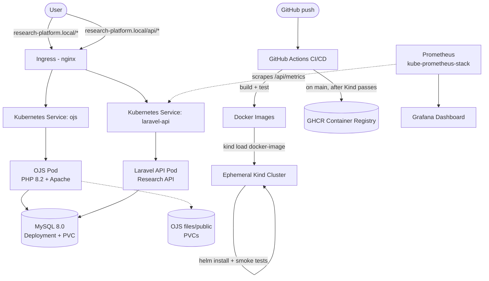

# Open Research Platform

A portfolio-quality deployment project built around **[Open Journal Systems (OJS)](https://pkp.sfu.ca/ojs/)** — containerized, deployed to Kubernetes via Helm, backed by MySQL, accompanied by a small Laravel REST API, and shipped through a CI/CD pipeline that deploys to a real (ephemeral, local) Kubernetes cluster on every push.

> **OJS itself is existing, third-party open-source software from the [Public Knowledge Project](https://pkp.sfu.ca/ojs/). I did not write OJS.** This project is the infrastructure, deployment, and integration work around it. See [What I Built](#what-i-built) below for the exact boundary.

## Architecture



## Technology stack

| Technology | Role |
|---|---|
| **OJS 3.5** (PKP) | The research/journal publishing platform itself — third-party software |
| **PHP 8.2** | Runtime for both OJS and the Laravel API |
| **Laravel 12** | Small companion "Research API" — REST endpoints for researchers/articles |
| **MySQL 8.0** | Database for both OJS and the Research API (separate logical databases, one server) |
| **Docker / Docker Compose** | Local containerized development |
| **Kubernetes (Kind locally)** | Container orchestration |
| **Helm** | Templated, environment-parameterized Kubernetes deployment |
| **GitHub Actions** | CI/CD — test, build, deploy to an ephemeral Kind cluster, smoke test, then push images |
| **kube-prometheus-stack (Prometheus + Grafana)** | Monitoring, installed via Helm rather than hand-written CRDs |

Why each of these, in more depth, is in [`docs/architecture.md`](docs/architecture.md).

## What I Built

| | |
|---|---|
| **OJS application** | PKP — not written by me. I did not modify OJS's own source. |
| **`ojs/` container build** (Dockerfile, entrypoint, healthcheck, PHP config) | Me |
| **MySQL deployment + init scripts** | Me |
| **`laravel-api/`** (entire Research API — models, controllers, migrations, tests, metrics) | Me, from scratch |
| **`k8s/` and `helm/`** (all Kubernetes manifests and the Helm chart) | Me |
| **`.github/workflows/ci-cd.yml`** (full CI/CD pipeline) | Me |
| **`monitoring/`** (kube-prometheus-stack values, Grafana dashboard, ServiceMonitor) | Me — using the upstream kube-prometheus-stack chart, not hand-written Prometheus Operator CRDs/RBAC |

## Prerequisites

- Docker + Docker Compose
- For Kubernetes: [Kind](https://kind.sigs.k8s.io/), `kubectl`, [Helm](https://helm.sh/docs/intro/install/)
- PHP 8.2 + Composer, only if you want to run the Laravel API's tests outside a container

## Quick start (Docker Compose)

```bash
git clone <your-repo-url> research-platform && cd research-platform
cp .env.example .env
# edit .env with real values (DB passwords, OJS_APP_KEY — generate with: openssl rand -base64 32)
bash scripts/bootstrap-laravel-api.sh
docker compose up --build
```

- OJS: http://localhost:8080
- Research API: http://localhost:8081/api/health

## Kubernetes / Helm deployment

Full step-by-step instructions (including secrets creation and monitoring setup) are in [`docs/deployment.md`](docs/deployment.md). Short version:

```bash
kind create cluster --name research-platform --config .github/kind-config.yaml
kubectl apply -f https://raw.githubusercontent.com/kubernetes/ingress-nginx/controller-v1.11.2/deploy/static/provider/kind/deploy.yaml
bash scripts/bootstrap-laravel-api.sh
docker build -t research-platform-ojs:dev ./ojs
docker build -t research-platform-laravel-api:dev ./laravel-api
kind load docker-image research-platform-ojs:dev --name research-platform
kind load docker-image research-platform-laravel-api:dev --name research-platform
# create secrets — see docs/security.md
helm install research-platform helm/research-platform -n research-platform --create-namespace \
  -f helm/research-platform/values-dev.yaml \
  --set ojs.image.repository=research-platform-ojs --set ojs.image.tag=dev --set ojs.image.pullPolicy=Never \
  --set laravelApi.image.repository=research-platform-laravel-api --set laravelApi.image.tag=dev --set laravelApi.image.pullPolicy=Never
```

Helm chart validation:
```bash
helm lint helm/research-platform
helm template research-platform helm/research-platform -f helm/research-platform/values-dev.yaml
helm upgrade research-platform helm/research-platform -n research-platform -f helm/research-platform/values-dev.yaml
helm rollback research-platform 1 -n research-platform
```

## CI/CD

`.github/workflows/ci-cd.yml` runs on every push/PR:

1. Lint + PHPUnit test the Laravel API (in-memory SQLite — no external DB needed)
2. Build both Docker images, scan the OJS image with Trivy
3. `helm lint` + `helm template` the chart against dev and prod values
4. **Spin up a real, ephemeral Kind cluster**, load the built images into it, `helm install` the full chart, wait for rollouts, and smoke-test both services **through the actual Ingress** — not just via port-forward
5. On failure: collect pod logs/descriptions as workflow artifacts
6. Tear down the Kind cluster
7. On `main`, after the Kind deployment passes: push images to GHCR
8. A documented, intentionally-disabled placeholder job shows exactly what a real cloud deployment step would need (see [`docs/deployment.md`](docs/deployment.md))

## Monitoring

Off by default (`monitoring.enabled: false`). Enable it with `kube-prometheus-stack` + this project's `ServiceMonitor` — full instructions in [`docs/deployment.md`](docs/deployment.md). The Laravel API exposes a small hand-rolled `/api/metrics` endpoint (request count, request duration sum/count, by route and status) backed by APCu; a Grafana dashboard for request rate, error rate, latency, and availability ships in `monitoring/grafana-dashboard-laravel-api.json`.

## Troubleshooting

See [`docs/troubleshooting.md`](docs/troubleshooting.md) for `CrashLoopBackOff`, `ImagePullBackOff`, DB connection failures, permission errors, PVC pending states, OJS config issues, Ingress problems, and Laravel migration failures, each with exact diagnostic commands.

## Security considerations

See [`docs/security.md`](docs/security.md). Short version: no secrets in Git, Kubernetes Secrets (not ConfigMaps) for credentials, non-root file ownership, resource limits everywhere, image scanning in CI — and an explicit, honest list of what is **not** production-hardened (no NetworkPolicies, no image signing, single-instance MySQL, etc.).

## Production considerations

This project is validated against a local Kind cluster, in CI and by hand — it is **not** deployed to, or tested against, a real cloud Kubernetes cluster. `docs/deployment.md` has a full table of exactly what would need to change to run this on AWS EKS (or GKE/AKS): image registry, storage classes, ingress controller + TLS, secrets management, and node sizing.

## Future improvements

- Real integration with OJS's own REST API for live article data, instead of the Research API's self-contained dataset (see `docs/architecture.md`)
- Redis-backed sessions + `ReadWriteMany` storage so OJS can run more than one replica
- A real Prometheus client library for histogram-based latency percentiles, instead of APCu sum/count averages
- NetworkPolicies restricting pod-to-pod traffic
- A tested cloud deployment (EKS/GKE/AKS), not just a documented migration path

## Resume-Relevant Skills Demonstrated

- Containerizing a legacy-style PHP/Apache application (OJS) with correct, version-verified PHP extensions and a non-trivial multi-stage entrypoint (config generation from env vars, DB readiness waiting)
- Building and deploying a small Laravel REST API with migrations, Eloquent models, validation, and feature tests
- Designing a Helm chart with environment-specific values (dev/prod), Kubernetes Secrets handled via an explicit opt-in creation pattern rather than plaintext defaults
- Writing a CI/CD pipeline that deploys to and smoke-tests against a real (if ephemeral, local) Kubernetes cluster — not just linting YAML
- Integrating an existing open-source platform (OJS) via infrastructure rather than modifying its source, and clearly documenting that boundary
- Setting up Prometheus/Grafana monitoring via an upstream Helm chart and a custom application-level metrics endpoint

**What I'm intentionally not claiming:** I did not build OJS, I have not tested this against a real cloud Kubernetes cluster, and the Laravel API's article data is a self-contained demo dataset, not a live OJS integration. See `docs/architecture.md` and the final validation report in this repo's PR/commit history for the full, honest picture.

## License

See [`LICENSE`](LICENSE). Note: this license covers the code in this repository (the `ojs/` build files, `laravel-api/`, `k8s/`, `helm/`, CI/CD, and docs) — it does **not** relicense OJS itself, which remains under its own GPL license as distributed by PKP.
